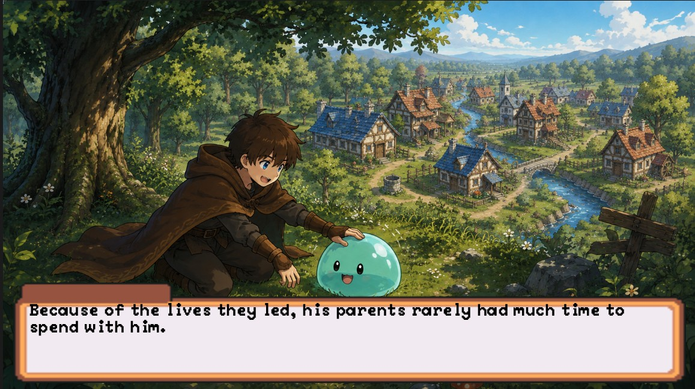
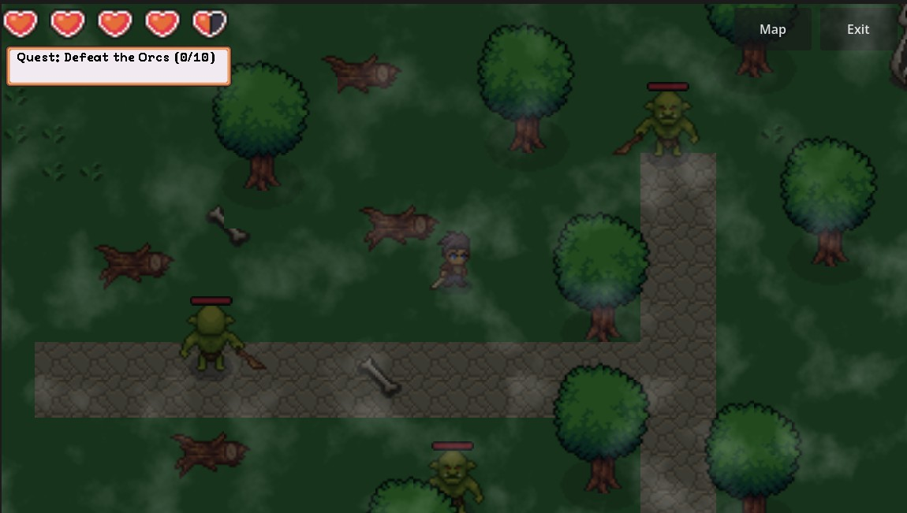

# Game Project 2D 
# By 673380317-5 ธนกร เวียงสิมา , 673380310-9 นายจิตติพัฒน์ ทวีโคตร , 673380337-9 นายภูมิรพี นามบุบผา
# EMBER HOME

"A 2D RPG Action adventure where the player must explore the Mist Forest, defeat the darkness of Temnota, and restore a ruined village back to its former glory."

GameStyle --Genre: 2D Action RPG / Adventure

Visual Style: 2D Pixel Art Mix


## Preview





- [Game Preview](https://ichizan.github.io/GameLab4/)


## Features

- **Game Menu** — A simple main menu scene (menu.tscn) with Start, Load, and Credit options, allowing players to begin anew or resume their adventure.

- **RPG Controller** — Responsive top-down movement and interaction mechanics, built for seamless exploration and combat.

- **Combat System** — Perform melee strikes or cast projectile magic (fireballs) to defeat monsters and boss encounters.

- **Enemy & Boss AI** — Enemies track and attack the player upon detection. The main boss (Temnota) utilizes a state machine for movement, melee, and ranged fireball attacks.

- **Interactive Dialogue System** — A custom UI layer that handles multi-line cutscenes and randomized NPC interactions, automatically pausing player movement during conversations.

- **Quest & Progression System** — The global GameManager tracks active quests, defeated enemies, and story flags. Completing objectives dynamically changes the world state (e.g., transforming ruin_village into heal_village).

- **Damage & Health System** — Entities take damage upon contact or projectile hits, featuring knockback physics and visual hit feedback. Health bars are displayed dynamically in the HUD.

- **Save & Load** — Save game progress (including current map, story progression, and quest states) directly to a local file and load it from the main menu.

- **Sound & Music Options** — Persistent audio settings managed via an AutoLoad OptionsMenu, allowing players to adjust BGM and SFX volumes via sliders mapped to Godot's AudioServer.

- **Level Management** — Clean and controlled scene transitions between maps using an interactive Map Select UI, preventing access to boss areas before meeting requirements.


1.Open the project in Godot 4.

Press F5 or click Play to run the main menu.

Speak to Elena to receive equipment upgrades before attempting to enter the Mist Forest or Temnota's domain.

Defeat the target number of Orcs to trigger the village restoration event.

## Project Structure

```
Scenes/
├── Actors/           # Player, enemies, and spawners
├── Scence/           # Level scenes, and UI
├── Managers/         # GameManager, SceneTransition, AudioManager


Assets/
├── Fonts/            # Custom fonts
├── Icons/            # UI icons
├── Sound/            # BGM and SFX
├── Spritesheet/      # Character and tile sprites
└── Textures/         # Particle and effect textures
```

## Controls

| Input | Action |
|-------|--------|
| A  | Move left |
| D | Move right |
| S | Move right |
| Left click | Attack |
| E | Interact |

## Saving

- Interact with Slime to save
- The game saves the player's position, score, lives, and audio settings.

## Credits
## THANK YOU FOR

- [Main Character](https://craftpix.net/freebies/free-swordsman-1-3-level-pixel-top-down-sprite-character-pack/)
- [Ruined House](https://mutterpixel-studio.itch.io/ruined-village-buildings-pixel-art-assets)
- [Village Asset](https://pixeljad.itch.io/villagetopdown)
- [Villages House](https://trislin.itch.io/pixel-lands-village)
- [Bridge](https://craftpix.net/freebies/free-bridges-top-down-pixel-art-asset-pack/)
- [Undead Tileset](https://craftpix.net/freebies/free-undead-tileset-top-down-pixel-art/?srsltid=AfmBOoo0L3KBInr3cAMJGajNkKVbvI20XnATxBXmF0Q-eWIHLw96TnQd)
- [Dungueon](https://craftpix.net/freebies/free-2d-top-down-pixel-dungeon-asset-pack/?srsltid=AfmBOopdY9tYk4A_Qfst1hHtUnfZD_fM2zDqmf8AtIM95JnEk_o8Yv6x0)
- [Temnota](https://craftpix.net/freebies/free-vampire-4-direction-pixel-character-sprite-pack/)
- [Orc](https://craftpix.net/freebies/free-top-down-orc-game-character-pixel-art/)
- [Slime](https://craftpix.net/freebies/free-slime-mobs-pixel-art-top-down-sprite-pack/)
- [Glassblower](https://craftpix.net/freebies/free-glassblowers-workshop-top-down-pixel-art-asset/)
- [HUD, Dialog , SFX , BGM](https://pixel-boy.itch.io/ninja-adventure-asset-pack)
- [Fronts](https://emhuo.itch.io/peaberry-pixel-font)
- [Icon](https://kenney.nl/assets/game-icons)
- [Fireball](https://craftpix.net/freebies/free-water-and-fire-magic-sprite-vector-pack/)
- [Orc Voice Pack](https://johncarroll.itch.io/orc-voice-pack)
- [Elena](https://liberatedpixelcup.github.io/Universal-LPC-Spritesheet-Character-Generator/)


**Disclaimer**
- This project was created for educational purposes. All third-party assets, including music, sound effects, and art, belong to their respective owners and are not used for commercial gain.


**Generative AI Usage**
- Generative AI was used in this project to create some cutscene artwork and audio assets.


**Modified for Educational Use By**
- College of Computing, Khon Kaen University
